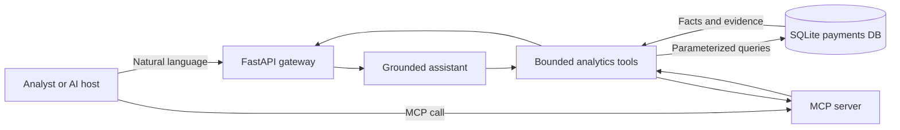

<div align="center">

# FinSight

### Ask financial questions. Get answers grounded in real transaction data.

[](https://www.python.org/)
[](https://fastapi.tiangolo.com/)
[](https://modelcontextprotocol.io/)

[Quick start](#-quick-start) · [Try it](#-try-it) · [MCP tools](#-mcp-tools) · [Roadmap](#-roadmap)

</div>

FinSight is an MCP-powered payments analytics service. Financial data stays behind bounded, auditable tools, allowing an AI host to retrieve facts without generating or executing raw SQL.

> **Demo question:** “Which merchants had unusual chargeback spikes?”<br>
> **Grounded answer:** “Detected 1 merchant chargeback anomaly: Ember Games.”

## ✨ What works today

- Generate deterministic synthetic payment data for eight merchants.
- Query transactions through safe filters instead of raw SQL.
- Compare merchant volume and chargeback performance.
- Detect chargeback-rate anomalies against a rolling baseline.
- Use every operation through REST or Model Context Protocol.
- Return the supporting rows with each chat answer.

## 🧭 Architecture



The assistant never receives database credentials or a raw-SQL tool. Both interfaces reuse the same analytics boundary.

## 🚀 Quick start

Requires Python 3.10+.

<details open>
<summary><strong>Windows PowerShell</strong></summary>

```powershell
py -m venv .venv
.venv\Scripts\python -m pip install -r requirements.txt
.venv\Scripts\python -m app.seed --rows 25000
.venv\Scripts\python -m uvicorn app.api:app --reload
```

</details>

<details>
<summary><strong>macOS or Linux</strong></summary>

```bash
python3 -m venv .venv
.venv/bin/python -m pip install -r requirements.txt
.venv/bin/python -m app.seed --rows 25000
.venv/bin/python -m uvicorn app.api:app --reload
```

</details>

Once running, choose an entry point:

| Explore | URL |
|---|---|
| Interactive REST documentation | <http://127.0.0.1:8000/docs> |
| Health check | <http://127.0.0.1:8000/health> |
| Streamable HTTP MCP endpoint | `http://127.0.0.1:8000/mcp` |

## 💬 Try it

Ask the grounded chat baseline about chargebacks:

```powershell
Invoke-RestMethod -Method Post `
  -Uri http://127.0.0.1:8000/api/chat `
  -ContentType application/json `
  -Body '{"question":"Which merchants had unusual chargeback spikes?"}'
```

<details>
<summary><strong>See an example response</strong></summary>

```json
{
  "answer": "Detected 1 merchant chargeback anomaly(s): Ember Games.",
  "tools_used": ["detect_anomalies"],
  "data": [
    {
      "merchant_id": "m_006",
      "merchant_name": "Ember Games",
      "baseline_chargeback_rate_pct": 2.12,
      "recent_chargeback_rate_pct": 14.55,
      "z_score": 10.16
    }
  ]
}
```

Exact rates vary with the day the deterministic dataset is generated.

</details>

Other useful prompts:

- `Which merchant had the highest transaction volume?`
- `Show me a merchant summary.`
- `Return the most recent transactions.`

## 🧰 MCP tools

<details open>
<summary><code>query_transactions</code></summary>

Returns recent payments filtered by merchant, date range, or chargeback status. Results are capped at 500 rows.

</details>

<details>
<summary><code>get_merchant_summary</code></summary>

Aggregates transaction count, payment volume, chargeback count, and chargeback rate by merchant.

</details>

<details>
<summary><code>detect_anomalies</code></summary>

Compares each merchant’s recent chargeback rate with its historical baseline and returns merchants above a configurable z-score threshold.

</details>

### REST equivalents

| Method | Endpoint | Purpose |
|---|---|---|
| `POST` | `/api/chat` | Route a supported analyst question to a grounded tool |
| `GET` | `/api/transactions` | Query bounded transaction records |
| `GET` | `/api/merchants/summary` | Compare merchant performance |
| `GET` | `/api/anomalies` | Detect chargeback-rate spikes |

## 🗂️ Project map

```text
app/
├── api.py          # FastAPI routes and MCP mount
├── assistant.py    # Deterministic question router
├── analytics.py    # Auditable financial queries
├── database.py     # SQLite schema and connection lifecycle
├── mcp_server.py   # MCP tool definitions
└── seed.py         # Synthetic payment generator
tests/
├── test_analytics.py
└── test_mcp.py
```

## ✅ Verify it

```powershell
.venv\Scripts\python -m unittest -v
```

The tests verify all three analytics paths, the intentional Ember Games anomaly, input bounds, and MCP tool discovery.

## 🛣️ Roadmap

- [x] Synthetic transaction dataset
- [x] Auditable analytics boundary
- [x] REST and MCP interfaces
- [x] Grounded chat baseline
- [ ] PostgreSQL data layer
- [ ] LLM tool-calling orchestrator
- [ ] React chat and chart dashboard
- [ ] Authentication, RBAC, and audit log
- [ ] Live Kafka transaction feed

## Current boundary

SQLite keeps the first demo zero-setup. The chat route is deliberately deterministic and supports a focused set of analyst intents; it does not pretend to understand arbitrary questions. PostgreSQL and an actual tool-calling LLM are the next useful slice.
